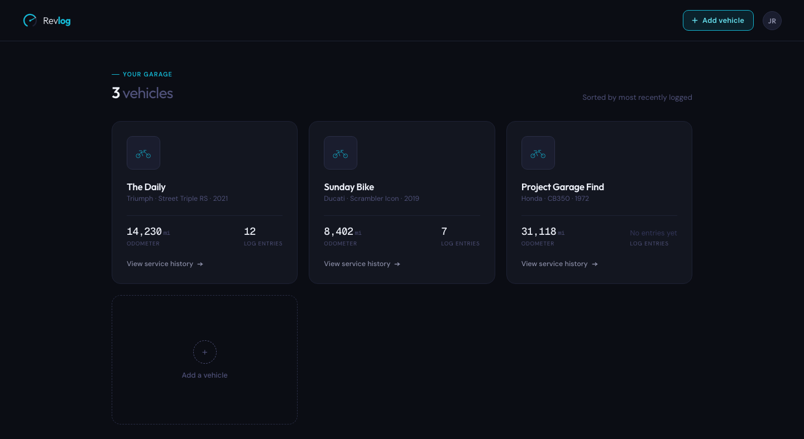
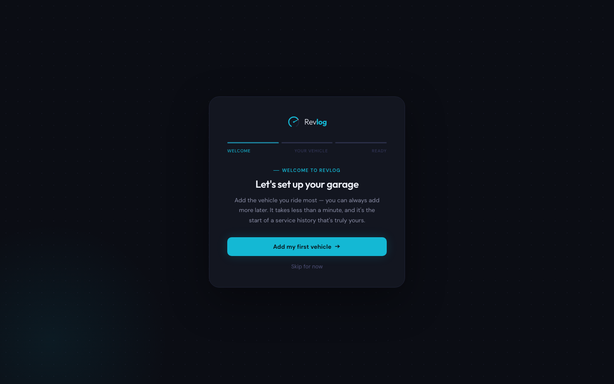
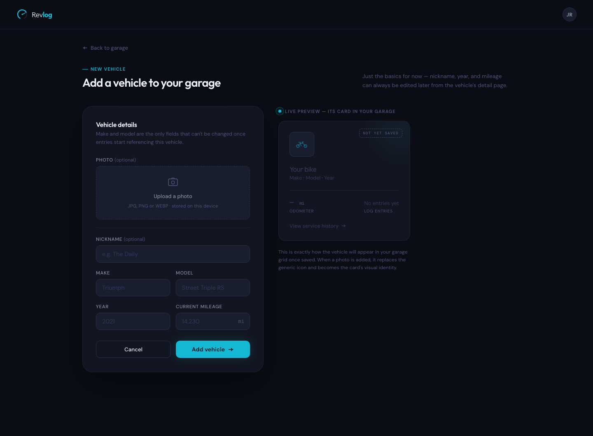
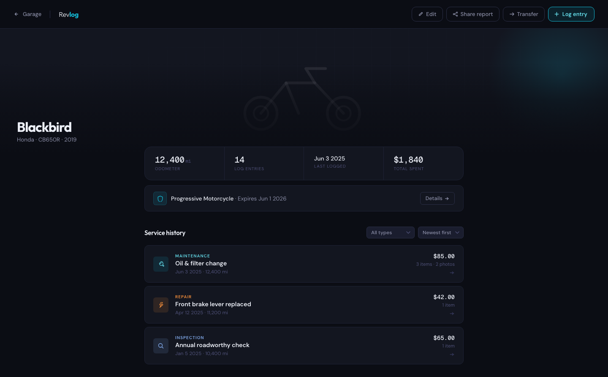
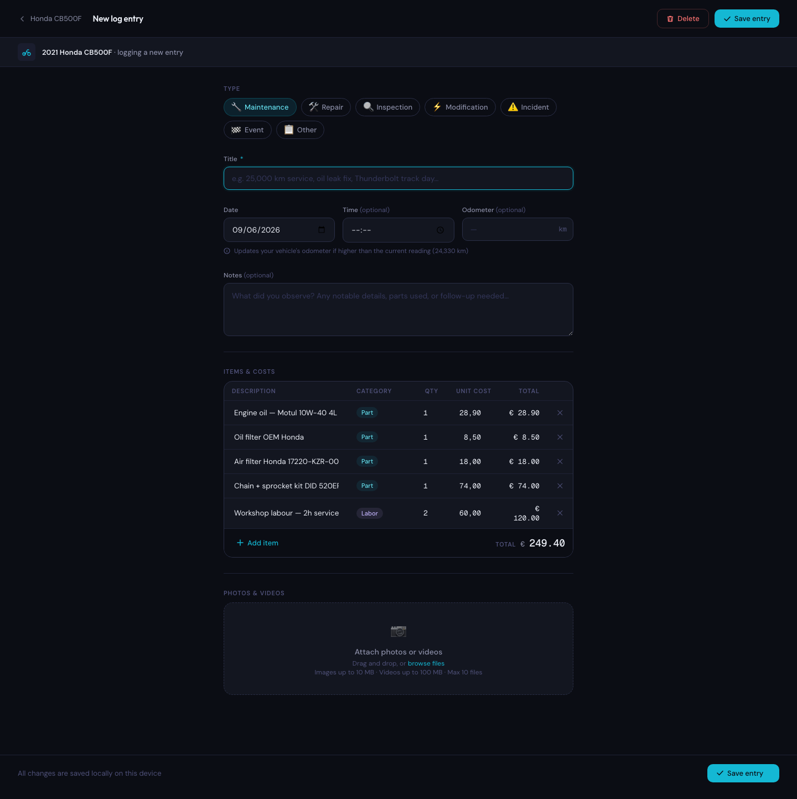
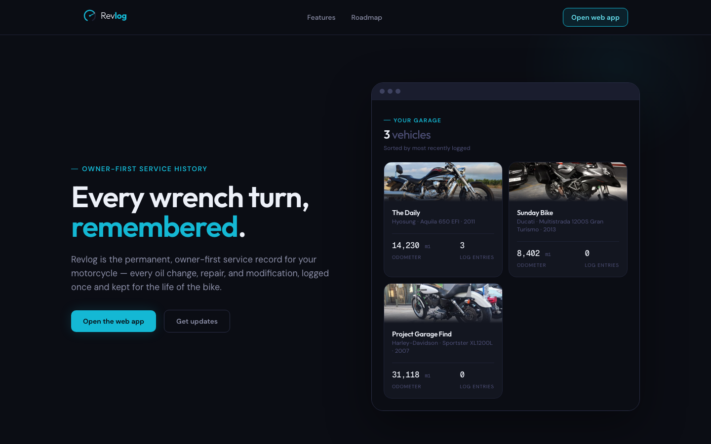
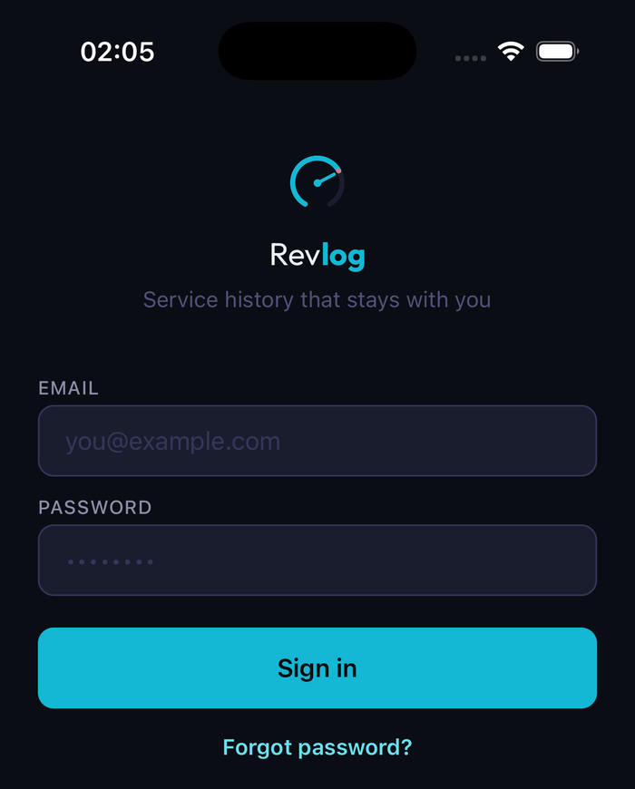
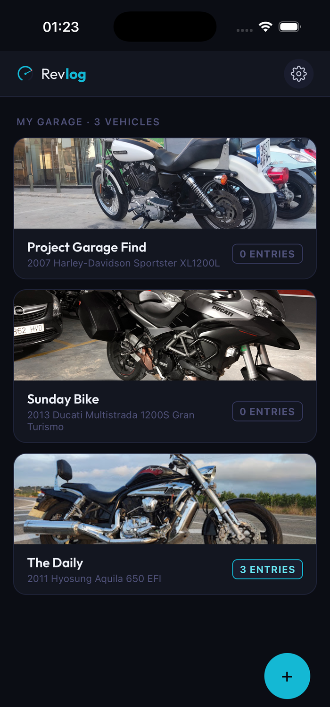
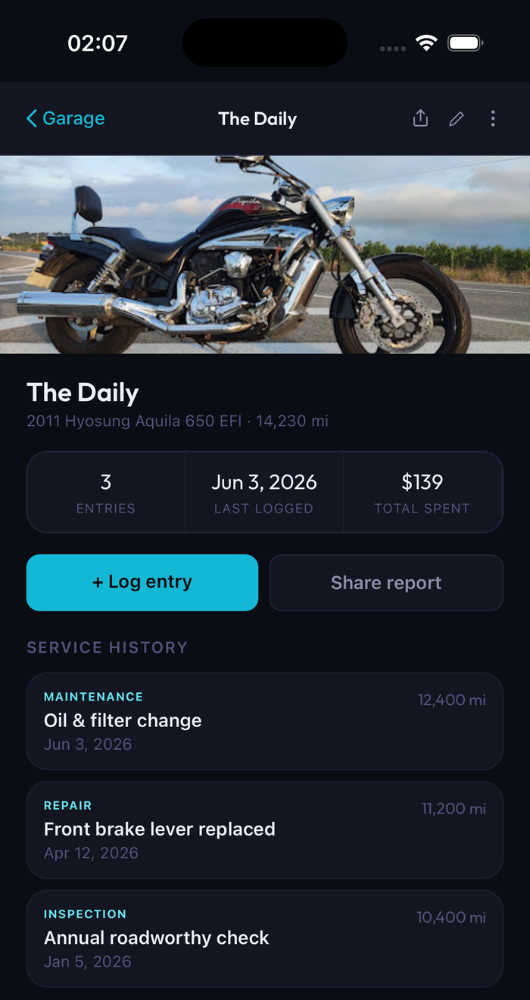

# Revlog

Motorcycle maintenance tracking for riders who care about their machines. Log service history, track parts and costs, and keep a full record of everything done to every bike — in one place.

V1 is personal accounts only: one rider, one garage, unlimited vehicles and log entries.



---

## Screens

<table>
<tr>
<td width="50%">

**Onboarding**
First-run setup gets a rider from zero to a saved vehicle in one short flow — no fields beyond what's needed to create the garage.



</td>
<td width="50%">

**Add a vehicle**
A live preview mirrors the exact card that will land in the garage grid, so there's no guessing what "Save" produces.



</td>
</tr>
<tr>
<td width="50%">

**Vehicle detail**
Odometer, log count, spend, and insurance status at a glance, with the full service history below.



</td>
<td width="50%">

**Log entry**
Itemized parts and labor with running totals — the record a mechanic (or a future buyer) would actually want to see.



</td>
</tr>
</table>

## Marketing site

`apps/website` is Revlog's public-facing marketing site — Astro + Tailwind, the same design tokens as the app. It's a separate deployable from the product itself: a hero, feature highlights, and live showcases of both the web and mobile apps (below).



## Mobile app

`apps/mobile` is a React Native (Expo) app sharing the same API, the same design tokens, and the same domain contracts as the web app — in progress, not yet published to an app store.

<table>
<tr>
<td align="center" width="33%">

**Login**



</td>
<td align="center" width="33%">

**Garage**



</td>
<td align="center" width="33%">

**Vehicle detail**



</td>
</tr>
</table>

## Design system

The interface follows a single documented design language — **"Precision Dark"**: a dark navy base, one electric-teal accent, and geometric type (`Outfit` for display, `DM Sans` for body, `Geist Mono` for numbers) inspired by digital instrument clusters. A few deliberate choices worth pointing out:

- **A recurring visual language, not a one-off skin.** The tachometer-arc logo extends into a gauge-tick step indicator for multi-step flows and a status orb for async states (seen above on email verification) — the same motif reused with intent, not different widgets bolted together.
- **Empty and stale states are designed, not defaulted.** A vehicle with no logged history reads "No entries yet" in a muted tone rather than a bare `0`, so the UI never implies something is wrong.
- **Restraint on data that isn't ready.** V1 deliberately shows no maintenance-due indicators on vehicle cards — that requires scheduling logic that doesn't exist yet, and a half-built "service due" signal would be worse than none. Purely descriptive data only, until the feature backing it is real.
- **Design tokens are enforced, not just documented.** Every color, spacing, and radius value is required to come from a single token package (`packages/ui/tokens`); a pre-commit hook scans staged files for raw hex codes and blocks the commit if it finds one. See [ADR 0007](docs/adr/0007-style-architecture-guardrails.md).

## How this was built

This project is built in close collaboration with [Claude Code](https://claude.com/claude-code). Every architecture decision goes through an [ADR](docs/adr/) before implementation; every feature gets a [spec](docs/specs/) with use cases and acceptance criteria before code is written. The goal isn't to hide AI involvement — it's to show a disciplined, reviewable process for directing it: documentation before code, one logical change per commit, and automated guardrails (lint rules, pre-commit hooks, unit + E2E tests) that hold regardless of who — or what — wrote the diff.

## Engineering

- **Hexagonal (ports & adapters) architecture** on both the API and the web app — see [ADR 0039](docs/adr/0039-hexagonal-architecture-api.md) (API) and [ADR 0040](docs/adr/0040-hexagonal-architecture-web.md) (web). Business logic never depends on a framework, transport, or database detail.
- **Shared contracts across web and mobile** — Zod validation schemas and API-client service functions live in shared packages (`packages/domain`, `packages/api-client`) so both apps validate and call the API identically.
- **Pure functional core / hook shell** for view logic ([ADR 0043](docs/adr/0043-viewmodel-pure-core-hook-shell-testing.md)) — business rules are stateless functions unit-tested directly; the React hook layer is a thin binding tested separately.
- **Structured logging, never `console.*`** — every I/O path logs through a shared Pino-based logger with proper levels; enforced by convention and code review, not just habit.
- **Tested at two levels** — Vitest unit tests for every API service/route and web viewmodel, Cypress E2E tests for every UI change's happy path and error states.

---

## Prerequisites

- **Node.js** 22+
- **pnpm** 11+
- **Docker** (for Postgres and Mailpit)

---

## First-time setup

```bash
# 1. Install dependencies
pnpm install

# 2. Install the pre-commit hook (hex color guard + lint)
pnpm hooks

# 3. Copy the API environment file and fill in values
cp apps/api/.env.example apps/api/.env
# Edit apps/api/.env — at minimum set JWT_SECRET to a random string

# 4. Start Postgres and Mailpit
pnpm db

# 5. Run database migrations
pnpm --filter @maintenance-log/api db:migrate
```

---

## Dev workflow

```bash
pnpm dev        # start API (port 3001) and web (port 3000) in parallel
```

| Service | URL |
|---|---|
| Web app | http://localhost:3000 |
| API | http://localhost:3001 |
| API health | http://localhost:3001/health |
| Mailpit (email UI) | http://localhost:8025 |

All outgoing emails in development are captured by Mailpit — nothing is sent to real addresses.

---

## Scripts

| Script | What it does |
|---|---|
| `pnpm dev` | Start all packages in watch mode (Turbo) |
| `pnpm build` | Production build of all packages |
| `pnpm lint` | ESLint across all packages |
| `pnpm type-check` | TypeScript type-check across all packages |
| `pnpm test` | Run all test suites (Vitest unit tests + Cypress E2E) |
| `pnpm clean` | Delete all build artifacts and `node_modules` |
| `pnpm hooks` | Install the pre-commit hook (run once after cloning) |
| `pnpm db` | Start Postgres and Mailpit via Docker Compose |
| `pnpm db:stop` | Stop Docker Compose services |
| `pnpm db:studio` | Open Prisma Studio (visual DB browser) |
| `pnpm smoke:auth` | End-to-end smoke test: register → verify email → confirm single-use |

---

## Testing

```bash
# API unit tests (Vitest — no DB required)
pnpm --filter @maintenance-log/api test

# Watch mode
pnpm --filter @maintenance-log/api test:watch

# E2E tests (Cypress — requires dev server running)
pnpm test

# End-to-end smoke test (requires pnpm dev + pnpm db)
pnpm smoke:auth
```

---

## Database

```bash
# Run pending migrations (also generates the Prisma client)
pnpm --filter @maintenance-log/api db:migrate

# Open the Prisma Studio GUI
pnpm db:studio

# Deploy migrations in production (no interactive prompt)
pnpm --filter @maintenance-log/api db:migrate:prod
```

Prisma schema: `apps/api/prisma/schema.prisma`
Migrations: `apps/api/prisma/migrations/`

---

## Environment variables

All environment configuration lives in `apps/api/.env` (gitignored). The example file documents every variable:

```
apps/api/.env.example
```

Key variables:

| Variable | Description |
|---|---|
| `DATABASE_URL` | Postgres connection string |
| `JWT_SECRET` | Secret for signing access tokens — **change in production** |
| `JWT_EXPIRES_IN` | Access token TTL (default: `15m`) |
| `JWT_REFRESH_EXPIRES_IN` | Refresh token TTL (default: `7d`) |
| `SMTP_HOST` / `SMTP_PORT` | SMTP server — `localhost:1025` for Mailpit in dev |
| `APP_URL` | Web app origin — used in verification email links |
| `LOG_LEVEL` | Pino log level: `error`, `warn`, `info`, `debug` (default: `info`) |

---

## Project structure

This is a pnpm/Turborepo monorepo — four deployables in `apps/`, sharing code through `packages/`.

```
apps/
  api/          Express API — hexagonal arch (domain → application → adapters), Prisma/Postgres
  web/          Next.js web app — App Router, hexagonal MVVM (ADR 0040)
  mobile/       React Native (Expo) app — same API, tokens, and contracts as web; in progress
  website/      Astro + Tailwind marketing site — public landing page, separate deployable
packages/
  domain/           (@maintenance-log/contracts) Zod schemas + inferred types shared by every
                    client and validated identically by the API
  api-client/       Typed service functions (auth, vehicles, log entries, …) over a shared
                    HttpClient port — web and mobile call the same functions (ADR 0024)
  ui/
    tokens/           (@maintenance-log/ui-tokens) Design token source of truth — colour,
                      spacing, radius, typography — the only place raw values may be defined
    components/       (@maintenance-log/ui-components) Shared DOM component system for web +
                      website; scaffolded, not yet populated — see Roadmap
  eslint-config/    Shared ESLint flat config (includes the no-inline-style rule)
  prettier-config/  Shared Prettier config
  typescript-config/ Shared tsconfig bases
docs/
  adr/            Architecture Decision Records — every significant technical choice
  specs/          Feature specs — use cases, acceptance criteria, API contracts
  milestones/     V1 and V2 scope and progress tracking
  designs/        Static HTML design previews used to build each screen (web + mobile)
  screenshots/    Screenshots used in this README
  past_sessions/  Dated summaries of past development sessions (goal, decisions, what shipped)
scripts/
  pre-commit    Git hook: blocks raw hex colors outside the token package
  smoke-auth.sh End-to-end auth smoke test
```

---

## Documentation

| File | Purpose |
|---|---|
| `CLAUDE.md` | Development rules — style, testing, observability, workflow |
| `CONTEXT.md` | Domain language glossary — canonical terms for the problem domain |
| `docs/adr/` | Architecture Decision Records — every significant technical choice |
| `docs/specs/` | Feature specs — use cases, acceptance criteria, API contracts |
| `docs/milestones/` | V1 and V2 scope and progress |
| `docs/designs/` | Static HTML design previews each screen was built from |
| `docs/past_sessions/` | Dated write-ups of past development sessions |
| `apps/api/CLAUDE.md` | API-specific rules — layered arch, DI, testing |
| `apps/web/CLAUDE.md` | Web-specific rules — style, logging, error boundaries |
| `apps/mobile/CLAUDE.md` | Mobile-specific rules — offline sync, outbox pattern |
